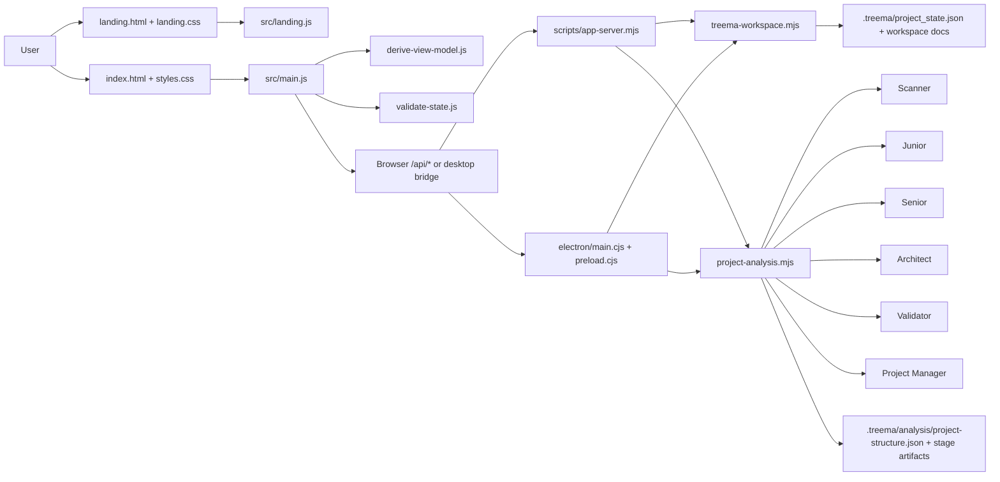

# TreeMA Project Structure Map

## Purpose

Provide an implementation-centered map of the current repository and its main modules.

## Canonical For

- Current repository entrypoints and major module responsibilities
- The high-level relationship between UI, shared logic, server, CLI, workspace, and staged analysis

## Not Canonical For

- Product scope or workflows that belong in [MVP_SPEC.md](MVP_SPEC.md)
- Runtime invariants that belong in [ARCHITECTURE.md](ARCHITECTURE.md)
- Detailed workspace file roles that belong in [TREEMA_WORKSPACE.md](TREEMA_WORKSPACE.md)

## Snapshot

- Runtime style: browser UI plus Node-based local server, Electron desktop shell, and CLI
- Hosted web style: `treesma.com` marketing surface plus `app.treesma.com` control-plane routes
- External dependencies: `electron` in `devDependencies`
- Frontend entry: `index.html` -> `src/main.js`
- Public landing entry: `landing.html` -> `src/landing.js`
- Desktop entry: `electron/main.cjs` -> `electron/preload.cjs`
- Shared domain logic: `src/lib/*.js`
- Local backend and filesystem integration: `scripts/*.mjs`
- Analysis pipeline entry: `scripts/lib/project-analysis.mjs`
- Docs contract validation: `scripts/check-docs.mjs`

## Major Areas

### UI surface

- `index.html`: static shell and scan/workspace/review panels
- `app/index.html`: hosted `app.treesma.com` entry page
- `app/auth/complete.html`: hosted web auth completion surface
- `app/settings/accounts.html`: hosted account-connection surface
- `app/settings/download.html`: hosted desktop setup surface
- `app/app.css`: hosted app visual system
- `app/app.js`: hosted app query parsing and auth-complete behavior
- `styles.css`: app styling, scan surface layout, and interactive inspector treatment
- `src/main.js`: application controller, sidebar navigation, workspace actions, settings, staged analysis rendering, and scan inspector selection state
- `landing.html`: public-facing landing page with product positioning and local run entry points
- `landing.css`: landing-specific visual system, responsive layout, and reduced-motion behavior
- `src/landing.js`: lightweight reveal and section-highlight behavior for the public landing page
- `privacy.html`: public-facing privacy policy page for the TreeMA MVP surface
- `support.html`: public-facing customer support page for the TreeMA MVP surface
- `terms.html`: public-facing terms of service page for the TreeMA MVP surface
- `legal.css`: shared legal-page styling for public policy documents
- `vercel.json`: deployment-time config that enables extensionless public URLs and redirects `/` to the landing page on Vercel
- `api/auth/github/start.mjs`: Vercel-hosted GitHub OAuth starter for the hosted web and desktop surfaces, including PKCE cookie setup
- `api/auth/github/callback.mjs`: Vercel-hosted public GitHub OAuth callback function for `treesma.com`, including token exchange and handoff
- `api/auth/openai/start.mjs`: Vercel-hosted ChatGPT Codex OAuth starter for the hosted web and desktop surfaces, including PKCE cookie setup
- `api/auth/openai/callback.mjs`: Vercel-hosted public OpenAI OAuth callback function for `treesma.com`, including hosted token exchange and desktop handoff

### Desktop shell

- `electron/main.cjs`: Electron main process, IPC handlers for workspace plus analysis actions, native folder picker integration, `treesma://` deep-link handling, desktop GitHub plus OpenAI OAuth loopback listeners, local token-handoff bridges, and cache-busted runtime-module imports during development
- `electron/preload.cjs`: isolated renderer bridge exposed as `window.treemaDesktop`, including desktop OAuth start flows, provider-preference persistence, analysis execution, workspace actions, and OAuth completion notifications

### Shared domain logic

- `src/lib/sidebar.js`: sidebar utility config plus project/thread grouping markup for the left rail
- `src/lib/derive-view-model.js`: summaries, tree derivation, boards, timeline, and focus views
- `src/lib/validate-state.js`: field, enum, timestamp, duplicate-id, and reference checks

### Server and CLI

- `scripts/app-server.mjs`: static server plus explicit local runtime routes:
  - `GET /api/settings/accounts`
  - `POST /api/settings/accounts/openai`
  - `POST /api/settings/accounts/openai/test`
  - `POST /api/settings/accounts/github-copilot`
  - `POST /api/settings/accounts/github-copilot/test`
  - `POST /api/settings/accounts/chatgpt-codex`
  - `POST /api/settings/accounts/chatgpt-codex/test`
  - `POST /api/settings/accounts/chatgpt-codex/oauth/start`
  - `POST /api/settings/accounts/chatgpt-codex/connect`
  - `POST /api/settings/accounts/preferences`
  - `POST /api/settings/accounts/disconnect`
  - `GET /api/workspace`
  - `POST /api/workspace/init`
  - `POST /api/workspace/snapshot`
  - `POST /api/project/analyze`
  - `POST /api/system/select-directory`
- `scripts/treema.mjs`: CLI for `init`, `snapshot`, and `analyze`
- `scripts/validate-state.mjs`: CLI validation runner
- `scripts/check-docs.mjs`: repo and workspace docs/schema contract validator

### Hosted deployment routes

- `api/auth/github/start.mjs`: Vercel function that creates hosted GitHub OAuth state, sets PKCE cookie state, and redirects to GitHub authorize
- `api/auth/github/callback.mjs`: Vercel function that validates GitHub OAuth state, exchanges tokens, and routes to `app.treesma.com` or the desktop loopback bridge
- `api/auth/openai/start.mjs`: Vercel function that creates hosted ChatGPT Codex OAuth state, sets PKCE cookie state, and redirects to OpenAI authorize
- `api/auth/openai/callback.mjs`: Vercel function that validates OpenAI OAuth state, exchanges tokens, and routes to `app.treesma.com` or the desktop loopback bridge
- `vercel.json`: host-based rewrites for `app.treesma.com`, plus the public hosted callback rewrite while keeping landing/legal clean URLs

### Workspace and analysis libraries

- `scripts/lib/account-settings.mjs`: local AI account settings persistence in `~/.treema/settings/accounts.json`, default provider selection, provider-agnostic OAuth state or PKCE helpers, callback receipt storage, scan-readiness metadata, secret masking, and provider verification outside `.treema`
- `scripts/lib/chatgpt-codex.mjs`: experimental ChatGPT Codex OAuth adapter, JWT account extraction, token exchange or refresh helpers, backend request shaping, and response-text extraction
- `scripts/lib/github-models.mjs`: shared GitHub Models catalog and lightweight inference-access probing used by account verification and Project Scan
- `scripts/lib/env-loader.mjs`: repo-local `.env.local` and `.env` loader for local runtime entrypoints
- `scripts/lib/oauth-handoff-contract.js`: shared desktop deep-link and loopback handoff contract for hosted OAuth completion
- `scripts/lib/treema-workspace.mjs`: template generation, workspace load, and snapshot persistence
- `scripts/lib/project-analysis.mjs`: top-level staged analysis orchestrator and load/persist entrypoint
- `scripts/lib/analysis/ai-client.mjs`: provider-aware stage execution, caching, structured-content extraction, and JSON repair handling for OpenAI API, GitHub Copilot, and ChatGPT Codex OAuth Project Scan
- `scripts/lib/analysis/contracts.mjs`: shared stage constants, artifact metadata helpers, and path contracts
- `scripts/lib/analysis/scanner.mjs`: deterministic evidence extraction plus AI-native semantic intake
- `scripts/lib/analysis/junior-analyst.mjs`: AI-grounded per-component structured analysis generation
- `scripts/lib/analysis/senior-analyst.mjs`: system synthesis, hierarchy, dependency, and gap generation
- `scripts/lib/analysis/solution-architect.mjs`: AI-assisted module/interface/build-order generation
- `scripts/lib/analysis/validator.mjs`: deterministic-first blocking and non-blocking validation rules with optional AI critique
- `scripts/lib/analysis/project-manager.mjs`: AI-assisted execution plan and task spec generation
- `scripts/lib/analysis/persist.mjs`: staged analysis load and save behavior

### Data and docs resources

- `examples/`: sample state and proposal payloads
- `schemas/`: JSON Schema artifacts for state and staged analysis
- `assets/landing/`: placeholder screenshot frames and OG artwork for the landing page
- `docs/`: canonical repo knowledge base

## Repository Tree

```text
TreeMA/
├── AGENTS.md
├── README.md
├── api/
│   └── auth/
│       ├── openai/
│       │   ├── start.mjs
│       │   └── callback.mjs
│       └── github/
│           ├── start.mjs
│           └── callback.mjs
├── app/
│   ├── app.css
│   ├── app.js
│   ├── auth/
│   │   └── complete.html
│   ├── index.html
│   └── settings/
│       ├── accounts.html
│       └── download.html
├── assets/
│   └── landing/
├── electron/
│   ├── main.cjs
│   └── preload.cjs
├── index.html
├── legal.css
├── landing.css
├── landing.html
├── privacy.html
├── styles.css
├── support.html
├── terms.html
├── vercel.json
├── package.json
├── docs/
│   ├── README.md
│   ├── ARCHITECTURE.md
│   ├── DATA_MODEL.md
│   ├── MVP_SPEC.md
│   ├── PLANS.md
│   ├── PROJECT_STRUCTURE.md
│   ├── QUALITY_SCORE.md
│   ├── TECH_DEBT.md
│   ├── TREEMA_WORKSPACE.md
│   └── exec-plans/
├── examples/
├── schemas/
│   ├── project_state.schema.json
│   ├── project_structure.schema.json
│   └── analysis/
├── scripts/
│   ├── app-server.mjs
│   ├── check-docs.mjs
│   ├── treema.mjs
│   ├── validate-state.mjs
│   └── lib/
│       ├── account-settings.mjs
│       ├── chatgpt-codex.mjs
│       ├── github-models.mjs
│       ├── oauth-handoff-contract.js
│       ├── project-analysis.mjs
│       ├── treema-workspace.mjs
│       └── analysis/
└── src/
    ├── landing.js
    ├── main.js
    └── lib/
        ├── sidebar.js
        ├── derive-view-model.js
        └── validate-state.js
```

## Runtime Relationship



## Contract Notes

- `src/main.js` uses one logical runtime contract in two transport modes:
  - browser mode through `fetch('/api/*')`
  - desktop mode through `window.treemaDesktop.*`
- `electron/preload.cjs` is the canonical renderer bridge surface for desktop mode. It exposes account settings, workspace, analysis, external-link, and OAuth-completion helpers only.
- `scripts/lib/oauth-handoff-contract.js` is the shared contract for desktop handoff URLs and `treesma://auth/complete` deep links used by hosted callback pages and the hosted auth-complete page.
- `scripts/lib/project-analysis.mjs` is the canonical scan orchestrator for both CLI and UI-triggered Project Scan.
- `.treema/analysis/project-structure.json` is the single manifest that points the UI at all emitted stage artifacts, including execution-plan outputs when the validator gate is `ready`.
- Local provider credentials persist outside project workspaces in `~/.treema/settings/accounts.json`. When `TREEMA_SETTINGS_HOME` is set (QA sandbox), the settings home is that directory and the account settings file path is treated as `${TREEMA_SETTINGS_HOME}/.treema/settings/accounts.json`.
- Route ownership is intentionally split:
  - local workspace shell: `index.html`, `src/main.js`, `styles.css`
  - hosted control plane: `app/index.html`, `app/app.js`, `app/app.css`, `app/auth/complete.html`, `app/settings/accounts.html`, `app/settings/download.html`
- Persistence ownership is also intentionally split by canonical writer, not by entrypoint:
  - `.treema` workspace reads and writes: `scripts/lib/treema-workspace.mjs`
  - `.treema/analysis` writes: `scripts/lib/project-analysis.mjs` and `scripts/lib/analysis/persist.mjs`
  - local account settings writes: `scripts/lib/account-settings.mjs`
- Contract enforcement runs through `scripts/check-docs.mjs`, `npm run validate:docs`, and `npm run validate`.
